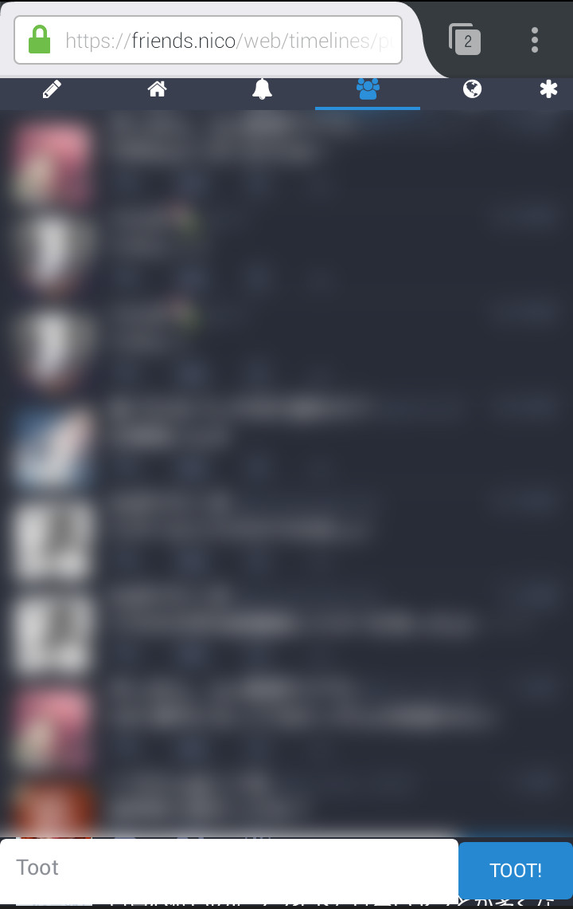

# Mastea

## 目次
- [これなに](#これなに)
- [インストール](#インストール)
- [その他](#その他)

## これなに

スマートフォンのWeb版Mastodonを便利にする拡張機能です。  
タイムラインを見ながらトゥートできるように画面下にトゥート入力欄があります。  
不要なスペースをなくし、表示できるトゥート数を増やしています。  
Twitterクライアントの「SobaCha」のようにしたくて作成しました。  

## インストール

Android版Firefoxで[ここ](https://github.com/choco-la/mastea/releases)のページの  
"mastea-[バージョン番号]-an.fx-android.xpi"
となっているリンクをクリックするとインストールできます。

## その他

* 動作確認環境  
OS: Android  
Webブラウザ: Firefox(PlayStore版)  

* アイコン画像  
  
[けものフレンズ](http://kemono-friends.jp/)の二次創作
